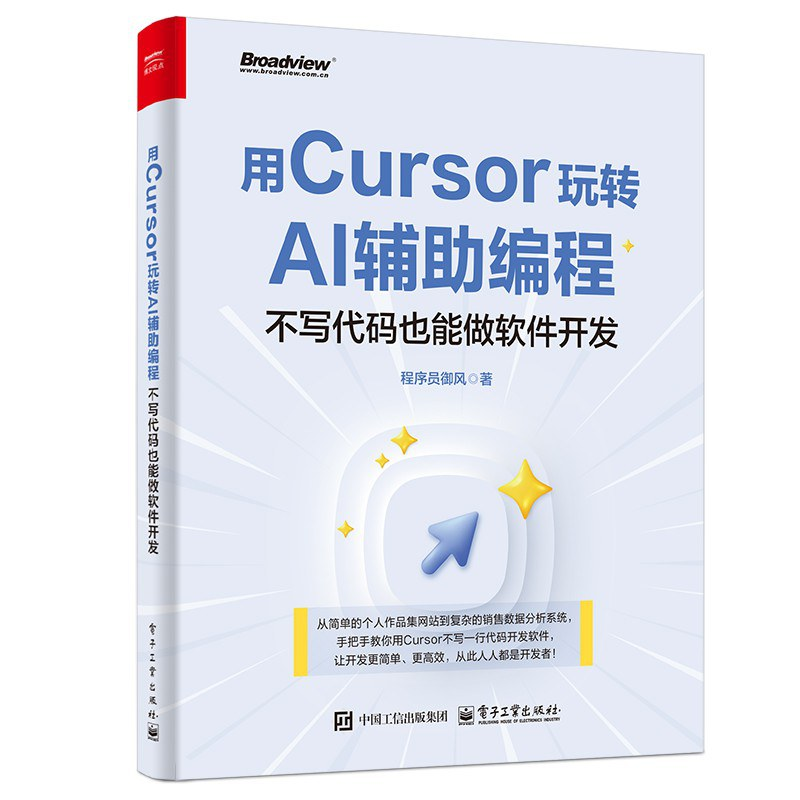
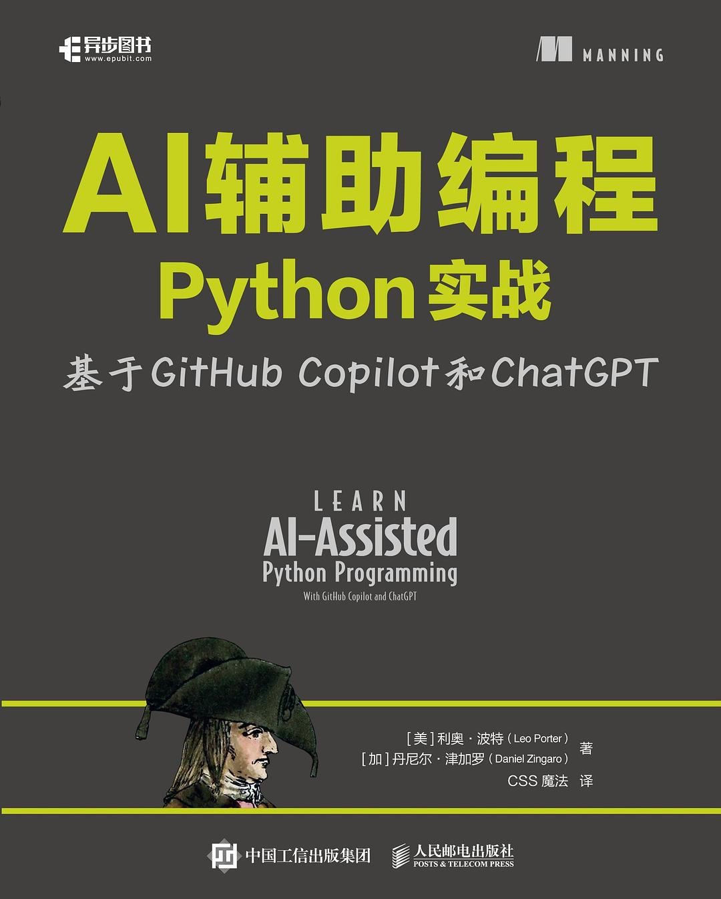
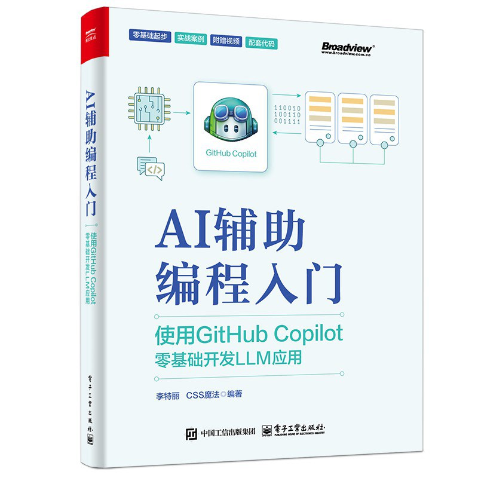
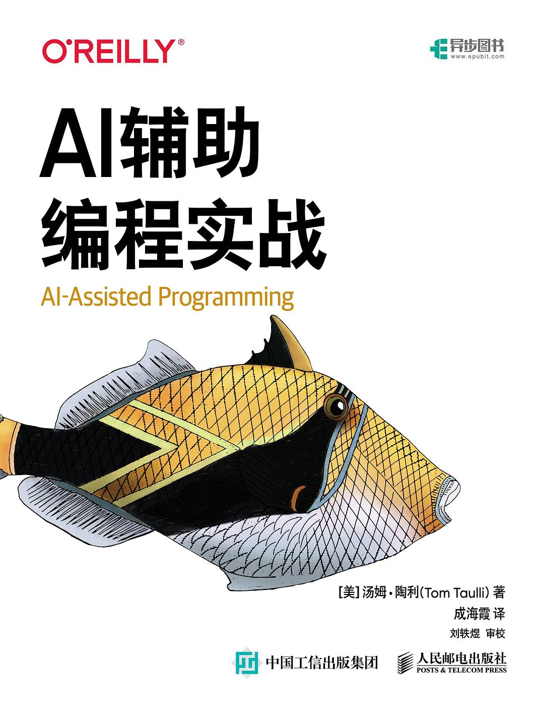
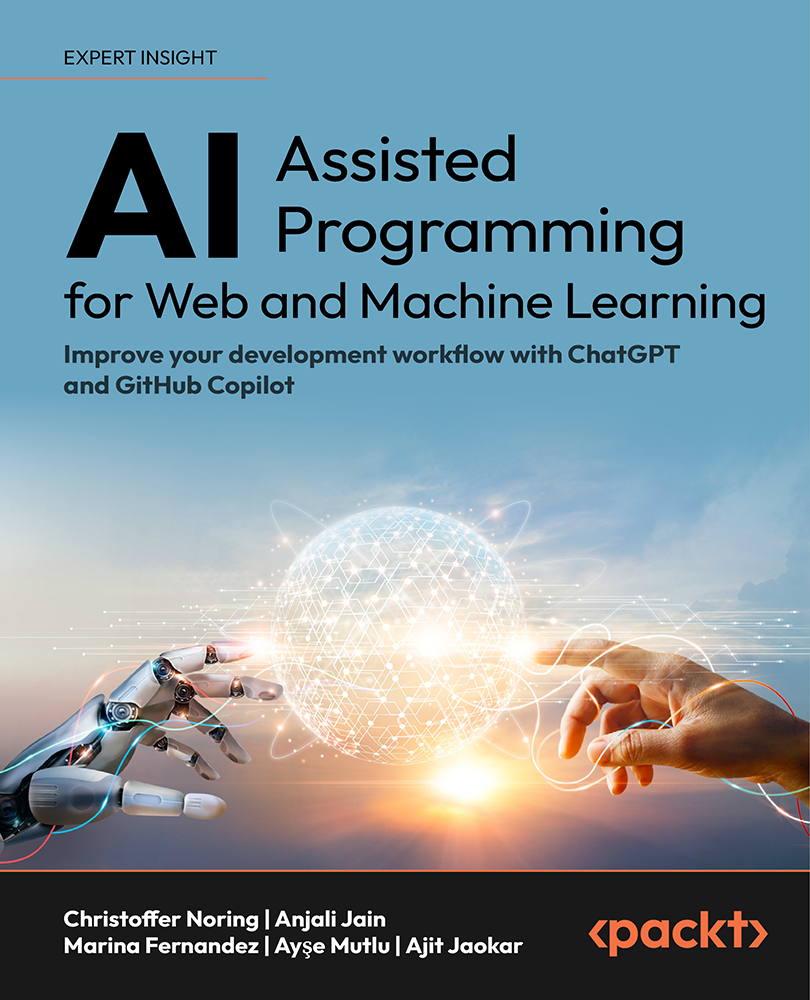
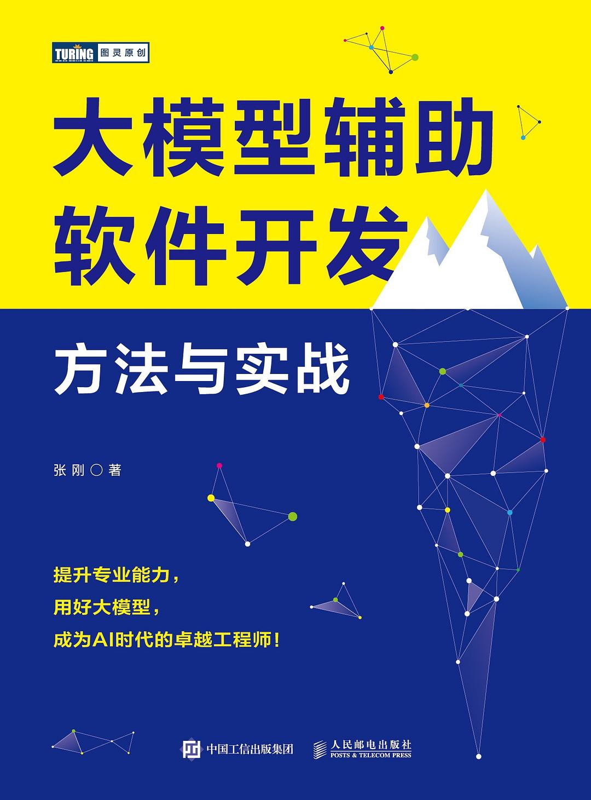
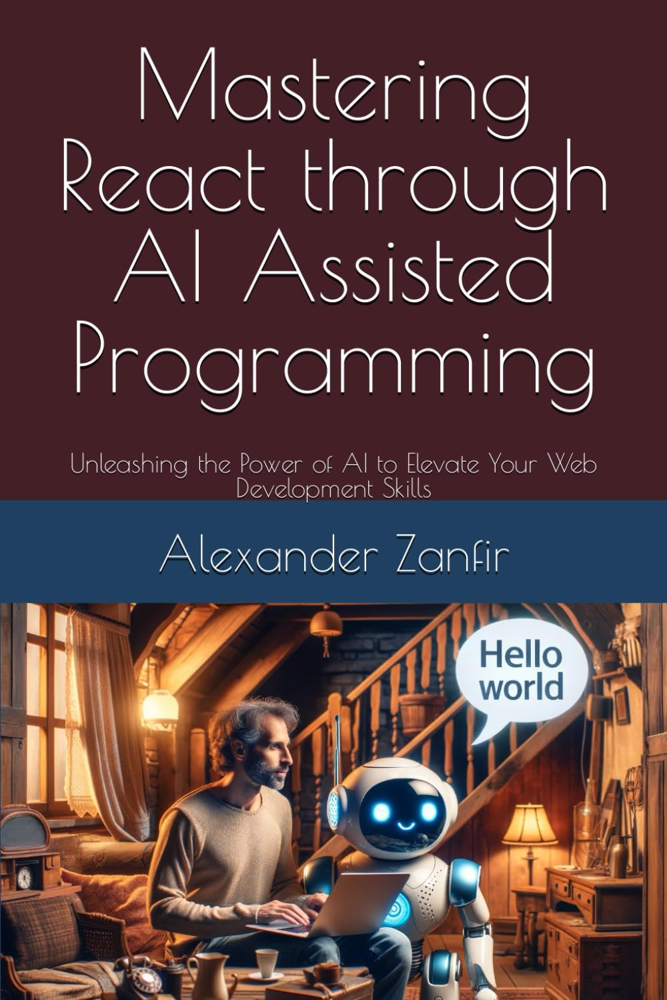
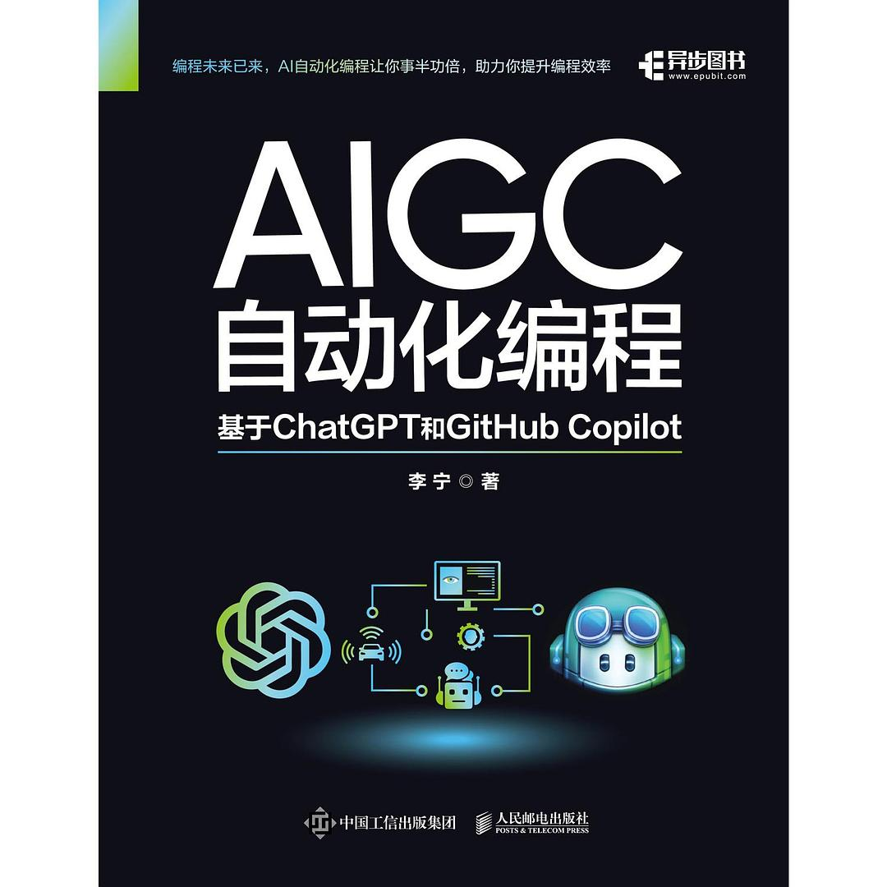

# 《AI编程助手：Vibe实战避坑记》试读与配套代码

对于需要提高编程效率但缺乏AI工具选择指南的IT新人和非技术职场人士，《AI编程助手：Vibe实战避坑记》是一本通过实战项目全面讲解和评测12款主流AI编程助手的实用指南，它通过Excel可视化、Excel数据处理和提示词优化Web应用开发的真实案例展示各工具的优劣势和适用场景，不同于市面上仅面向专业开发者或只介绍单一工具的图书，本书首次面向广泛受众提供了全流程AI辅助开发的方法论和评估框架，让任何人都能通过Vibe编程快速构建实用应用。

## 目录（持续更新中；第5章可供试读）

序言

前言

AI编程助手与Vibe编程的价值

目标读者

如何阅读

本书配套代码

致谢

作者简介

第1章 颠覆传统的AI编程助手与Vibe编程

1.1 用豆包编程批量改文件名

1.2 什么是AI编程助手

1.2.1 AI编程助手极简史

1.2.2 四类AI编程助手

1.3 什么是Vibe编程

1.4 如何颠覆传统

1.5 代码生成的原理

1.6 比代码还重要的提示词

1.7 代码生成的风险

1.8 AI辅助开发完整过程

1.9 用实战评估AI工具

第2章 用DeepSeek可视化Excel数据

第3章 用元宝分析Excel数据

第4章 用扣子实现提示词优化应用

[第5章 用GitHub Copilot实现提示词优化Web应用](./ch05-copilot/book/ch05.md)

5.1 Promptyoo-0 Web应用需求分析

5.2 架构设计与Ask模式

5.2.1 前后端分离的架构

5.2.2 用Ask子模式获取架构建议

5.3 任务拆解

5.4 用户界面与Vision

5.4.1 拼凑用户界面

5.4.2 为拼凑界面生成文字描述

5.4.3 用RABPOC生成高质量提示词

5.5 用bolt生成React前端代码

5.5.1 在本地电脑运行前端

5.5.2 看懂前端代码与/explain和#codebase

5.5.3 格式化代码与自动生成提交信息

5.5.4 用Inline Chat的/doc为代码加注释

5.5.5 用Inline Chat的/fix修复问题

5.6 Node.js后端代码

5.6.1 备好发给后端的提示词与Edit子模式

5.6.2 生成后端代码与Agent子模式

5.6.3 修复运行错误与Ask子模式下的@terminal

5.6.4 点按钮无反应与Ask子模式下的/fix

5.7 前端单元测试

5.7.1 搭建测试框架与/setupTests 

5.7.2 验证按钮的前端单元测试与/tests

5.7.3 验证前端单元测试的保护效果

5.7.4 生成其他关键前端单元测试

5.8 后端单元测试

5.8.1 用/setupTest时踩坑

5.8.2 用Claude官网时踩坑

5.8.3 换思路用好Claude官网

5.8.4 验证后端单元测试的保护效果

5.9 代码评审

5.9.1 软件架构可视化与/explain

5.9.2 用Review and Comment评审代码

第6章 用Cursor实现提示词优化Web应用

第7章 用Windsurf IDE实现提示词优化历史管理

第8章 用cline实现i18n国际化

第9章 用Augment Code实现提示词优化Web应用

第10章 用实战来评估

附录

附录1.1 使用终端

附录1.2 下载本书配套代码

附录1.3 安装VSCode

附录5.1 安装GitHub Copilot

附录5.2 在个人目录解压zip包

附录5.3 在本地终端运行命令npm

附录5.4 在本地终端运行命令出错时

附录5.5 安装git

## 版权许可协议

[《AI编程助手：Vibe实战避坑记》AI Programming Assistants and Vibe Coding](https://github.com/wubin28/book-ai-programming-assistants-and-vibe-coding) © 2025 作者 [吾真本](https://github.com/wubin28) 采用 [CC BY-NC-ND 4.0](https://creativecommons.org/licenses/by-nc-nd/4.0/?ref=chooser-v1) 许可协议

本书采用知识共享署名-非商业性使用-禁止演绎 4.0 国际许可协议（CC BY-NC-ND 4.0）进行许可。

该协议允许你分享本书，但有以下严格限制：

- 署名（BY）：分享时必须注明吾真本为原作者，不得隐瞒或更改此信息。
- 非商业性使用（NC）：本书仅限非商业用途，不得用于盈利或商业项目。
- 禁止演绎（ND）：你可以分享本书的原始版本，但不得改编、修改或重新创作。换言之，不能对本书内容进行任何改变或添加。

这个协议具体意味着：

- 可以分享，但不得更改：你可以在网上分享本书，但必须保持原样，不得修改任何内容。
- 禁止商业用途：本书不得用于任何商业环境，如广告、出版物或付费项目。
- 保护原作完整性：此协议帮助原作者维护作品的完整性和原创性，防止他人进行二次创作或商业利用。

简而言之，CC BY-NC-ND 4.0 是一个相对严格的协议。它允许自由分享本书，但禁止任何形式的改编或商业利用。

## 本书内容范围与结构

本书共分五部分：

第一部分：用一章介绍AI编程助手和Vibe编程的基本情况和发展。

第二部分：用三章讲解如何用DeepSeek、元宝和扣子这三款手机/电脑/网页端AI助手依次完成三个项目：

- Excel数据可视化
- Excel数据分析
- 提示词优化扣子应用

第三部分：用两章展示如何用经典AI插件IDE和AI原生IDE开发提示词优化Web应用，包括：

- AI插件IDE（即带有AI插件的传统IDE）：GitHub Copilot
- AI原生IDE：Cursor
- 其间结合使用电脑/网页端工具：bolt.new、lovable和Claude官网

第四部分：用三章展示如何用Windsurf IDE、cline和Augment Code实现并扩展提示词优化Web应用的功能。

第五部分：用一章总结12款AI编程助手的使用效果及选择建议。

## 写作特点

不盲目采信官方文档，也不简单罗列网上可查的功能清单，而是通过Vibe编程实战项目（暗线）验证3大类12款主流AI编程助手（主线）的特点、优劣势和适用场景，为读者选择AI编程助手提供第一手参考资料。

## 内容摘要

《AI编程助手：Vibe实战避坑记》是一本面向IT新人、职场人士与在职软件开发者的实战指南，系统讲解并评测了三大类12款主流AI编程助手在"Vibe（氛围式）编程"中的应用效果。全书通过三个实际项目——Excel数据可视化、Excel数据分析及Promptyoo提示词优化Web应用工具的开发，展示DeepSeek、元宝、扣子、Claude官网、GitHub Copilot、Cursor等工具的实战技巧与避坑策略。内容涵盖从需求分析到代码评审的完整开发流程，不仅讲述工具使用方法，更提供评估框架与方法论，帮助读者在快速变化的AI工具生态中做出明智选择。本书独特之处在于突破了传统编程书籍的局限，使非技术背景人士也能通过AI助手的编程工作高效解决自己所面临的问题，真正实现"人人皆可编程"的愿景。

## 目标读者

本书主要面向**三类AI编程新手：**

- IT行业新人：计算机及非计算机专业的应届生和转码人士，需要更高效的编程入门方法
- 非IT人士：需要处理数据或构建原型的职场人士、研究人员和产品经理
- 在职IT人士：使用传统编程方法的开发者，需要了解AI编程助手的特点

## 市场背景

AI编程助手的兴起源于2021年6月GitHub发布的GitHub Copilot。该工具能通过分析现有代码，在编程过程中自动提供多个版本的高质量代码补全和编写建议，其效果远超从问答网站手动复制粘贴代码的传统方式。截至2025年，AI编程工具已发展出四大类：

1. 手机/电脑/网页端类：如Claude、DeepSeek、豆包、元宝、扣子、bolt.new和lovable；
2. AI插件IDE类：如GitHub Copilot、Augment Code和Cline；
3. AI原生IDE类：如Cursor和Windsurf；
4. 终端命令行类：如Claude Code和Aider。

氛围式（Vibe）编程是一种依赖AI的编程方式。用户（包括非IT背景人士）只需用自然语言向LLM（大语言模型）描述需求，LLM就能生成软件代码，以实现相应的需求。这让编程从手动编写代码转变为引导AI生成代码。借助氛围式编程，即使是编程新手也能开发软件。这一术语由OpenAI创始团队成员Andrej Karpathy于2025年2月首次提出。Karpathy之所以把这种编程方式称作氛围式（vibe），因为它创造了一种人机协作的自然"氛围"，而不是单纯专注于代码本身。

根据国外知名程序员问答网站[StackOverflow](https://survey.stackoverflow.co/2024/ai)和知名编程工具厂商[JetBrains](https://www.jetbrains.com/lp/devecosystem-2024/#ai)2024年的调查报告显示，**约70%的开发者已采纳或计划采纳AI编程助手**——Stack Overflow调查为76%，JetBrains为69%。AI工具的核心价值在于**效率提升、学习加速和生产力优化**，特别是在自动化重复任务和降低认知负荷方面表现优异。随着技术日趋成熟，AI助手正逐渐成为开发者工作流程中的必备工具。

## 本书卖点

- **实战导向，快速上手**：通过**可视化Excel数据、数据分析、AI提示词优化**三大Vibe编程实战项目，帮助读者在实际开发中掌握AI编程助手的核心技巧，解决真实问题。
- **主流AI工具全覆盖**：详细讲解**12款主流AI编程助手**的使用方法，包括最新发布的**DeepSeek-R1、Lovable、bolt.new、Augment Code、Cline**等，确保内容前沿性。
- **从零基础到进阶**：不仅适合**IT从业者**，也适合**零基础职场人士、产品经理、研究人员**，降低AI编程的学习门槛。
- **长期价值**：不仅介绍工具的具体用法，更提供**AI工具评估方法、提示词优化技巧**，使读者能持续适应未来AI技术的发展。
- **全流程覆盖**：涵盖**需求分析、架构设计、代码编写、测试、代码评审**等完整开发流程，帮助读者利用AI编写高质量、可维护的代码。

## 本书独特优势

- **受众广泛，突破传统局限**：区别于其他相关书籍主要面向程序员，本书首次同时面向**IT新人、在职程序员、非技术岗人士**（如产品经理、研究人员等），填补市场空白，拓宽读者群体。
- **聚焦最新AI工具和Vibe编程实践**：涵盖2024～2025年新发布的7**款主流AI编程助手**（如扣子、元宝、cline、DeepSeek-R1、bolt.new、lovable和Augment Code等），以及2025年2月新提出的Vibe编程方法，确保内容时效性，领先同类书籍。
- **实战与评估结合**：不仅教工具使用，更通过**项目实战+评估方法**，让读者学会如何判断AI工具的实际效果，提升长期适应能力。
- **全流程AI辅助开发**：覆盖**需求分析→架构设计→编码→测试→评审**全流程，展示AI如何真正提升开发效率，而不仅是代码生成。
- **经久不衰的方法论**：即使未来AI工具迭代，书中提供的**评估框架、提示词技巧、实战方法论**仍可持续适用，延长书籍生命周期。

## 8本同类书情况（新出版的靠前）

- 《[用Cursor玩转AI辅助编程：不写代码也能做软件开发](https://book.douban.com/subject/37314193/)》；程序员御风著；2025年4月；电子工业出版社博文视点；89元；豆瓣目前无人评价。该书重点介绍如何用Cursor实现个人作品集网站和销售数据分析的后端（Python）与前端（Vue.js）应用。



- 《[AI辅助编程Python实战：基于GitHub Copilot和ChatGPT](https://book.douban.com/subject/37261655/)》；[美] 利奥·波特（Leo Porter） 著，CSS魔法 译；2025.03.01；人民邮电出版社异步图书；89.8元；豆瓣目前无人评价。该书侧重于通过 AI 学习 Python。介绍了GitHub Copilot 和 ChatGPT两种AI编程助手。




- 《[AI辅助编程入门：使用GitHub Copilot零基础开发LLM应用](https://book.douban.com/subject/37081056/)》；李特丽/CSS魔法编著；2024.11.01；电子工业出版社博文视点；89元；豆瓣评价人数不足。该书末尾提供2章实战内容。重点介绍GitHub Copilot工具。



- 《[AI辅助编程实战](https://book.douban.com/subject/37061040/)》；[美] 汤姆·陶利（Tom Taulli）著，成海霞译；2024年10月1日；人民邮电出版社；69.8元；豆瓣评分4.4分。该书面向IT开发人员讲解在需求分析、编程、调试、测试和部署场景下使用GitHub Copilot等工具时编写AI提示词的技巧。



- 《[AI-Assisted Programming for Web and Machine Learning](https://www.packtpub.com/en-ar/product/ai-assisted-programming-for-web-and-machine-learning-9781835086056)》；Christoffer Noring等著；2024年；Packt。该书讨论如何构建应用程序和机器学习模型并实现重复任务自动化。



- 《[大模型辅助软件开发：方法与实战](https://book.douban.com/subject/37010014/)》；张刚著；2024.08.01；人民邮电出版社图灵；63元；豆瓣评价人数不足。该书围绕真实的案例，借助大模型，实现从业务探索、需求分析、架构设计、编码实现到上线运行的完整过程。



- 《[Mastering react through ai assisted programming](https://www.amazon.com/Mastering-React-through-Assisted-Programming/dp/B0CTQXMGX3)》；Alexander Zanfir著；2024.01.31；独立出版。该书讨论了如何用ChatGPT实现全栈MERN（MongoDB、Express、React、Node.js）的博客web app项目。



- 《[AIGC自动化编程：基于ChatGPT和GitHub Copilot](https://book.douban.com/subject/36561231/)》；李宁著；2023年10月；人民邮电出版社异步社区；79.8元；豆瓣评价人数不足。该书重点介绍如何用GitHub Copilot和ChatGPT编写桌面应用、Web应用、游戏、办公自动化等应用。



## 本代码库仓库结构

每章都有独立的目录，包含相应的项目代码示例。结构组织如下：

```
/ch01
...
/ch04
    ├── /frontend
    ├── /backend
    ├── /prompts
...
```

## 克隆配套代码

```
git clone https://github.com/wubin28/book-ai-programming-assistants-and-vibe-coding.git

# 或者
# git clone https://gitee.com/wubin28/book-ai-programming-assistants-and-vibe-coding.git

cd book-ai-programming-assistants-and-vibe-coding
```

## 贡献

本仓库与书籍创作同步维护。如果你发现任何问题、有改进建议或想要贡献代码，欢迎提出问题或提交拉取请求。

## 如何联系

作者vx: wuzhenben001；备注：ai-vibe

祝你vibe编程愉快！✨