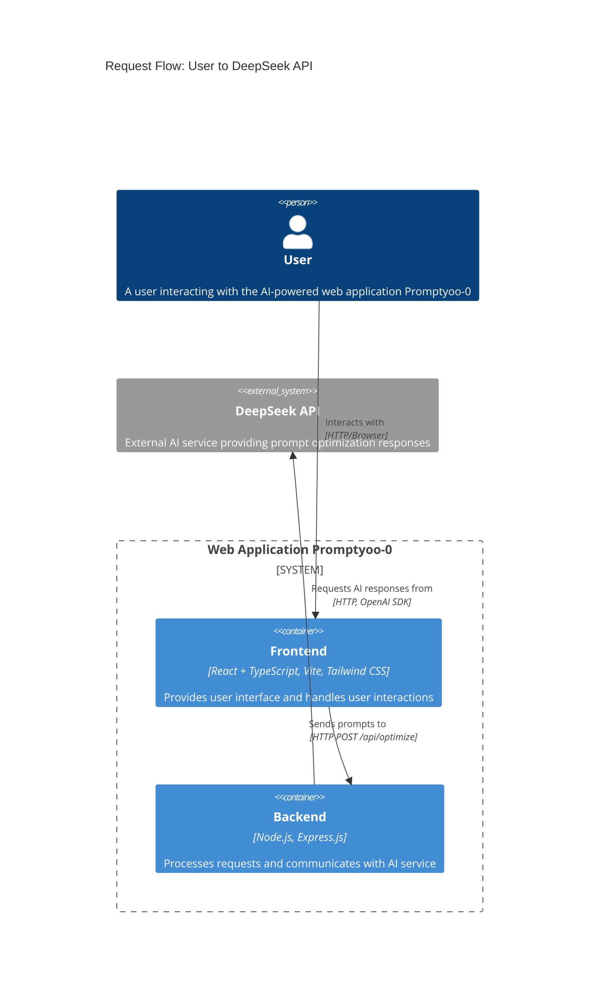

```mermaid
C4Context
    title Request Flow: User to DeepSeek API
    Person(user, "User", "A user interacting with the AI-powered web application Promptyoo-0")
    
    System_Boundary(webApp, "Web Application Promptyoo-0") {
        Container(frontend, "Frontend", "React + TypeScript, Vite, Tailwind CSS", "Provides user interface and handles user interactions")
        Container(backend, "Backend", "Node.js, Express.js", "Processes requests and communicates with AI service")
    }
    
    System_Ext(deepseekAPI, "DeepSeek API", "External AI service providing prompt optimization responses")
    
    Rel(user, frontend, "Interacts with", "HTTP/Browser")
    Rel(frontend, backend, "Sends prompts to", "HTTP POST /api/optimize")
    Rel(backend, deepseekAPI, "Requests AI responses from", "HTTP, OpenAI SDK")
    
    UpdateRelStyle(user, frontend, $offsetY="-50", $offsetX="10")
    UpdateRelStyle(frontend, backend, $offsetY="-30", $offsetX="-40")
    UpdateRelStyle(backend, deepseekAPI, $offsetY="-40", $offsetX="10")
```